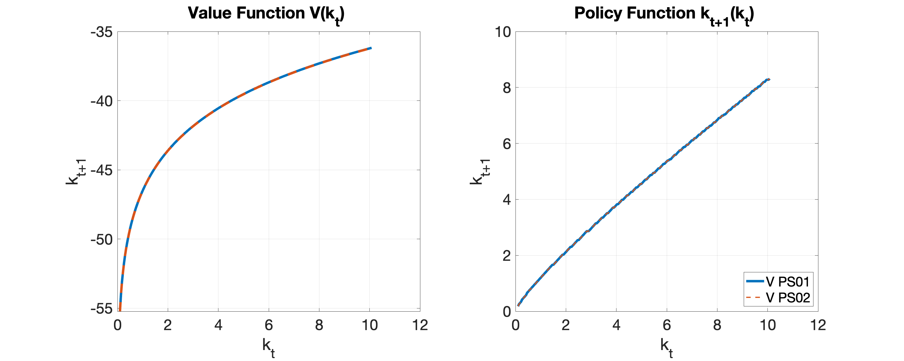
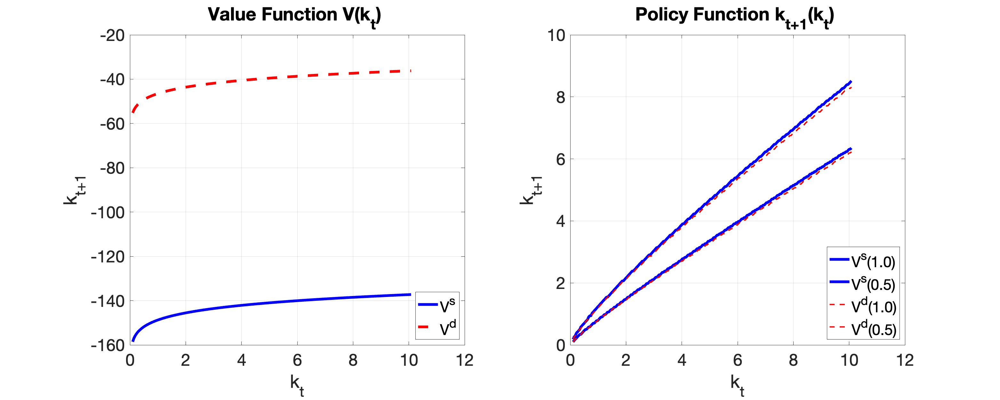
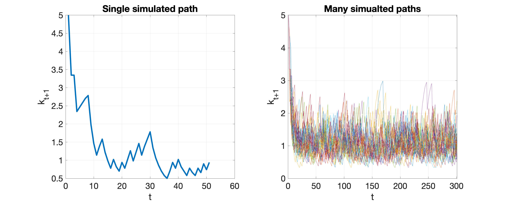
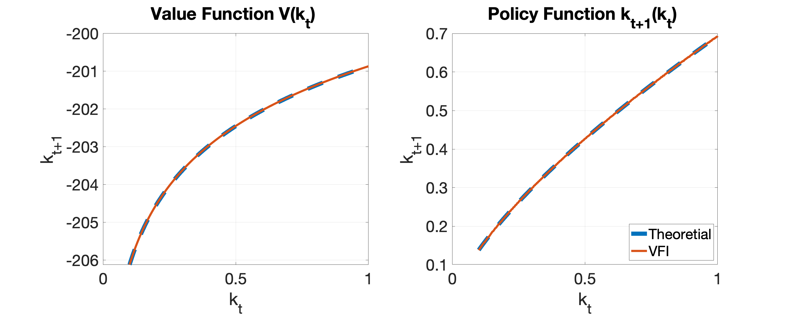
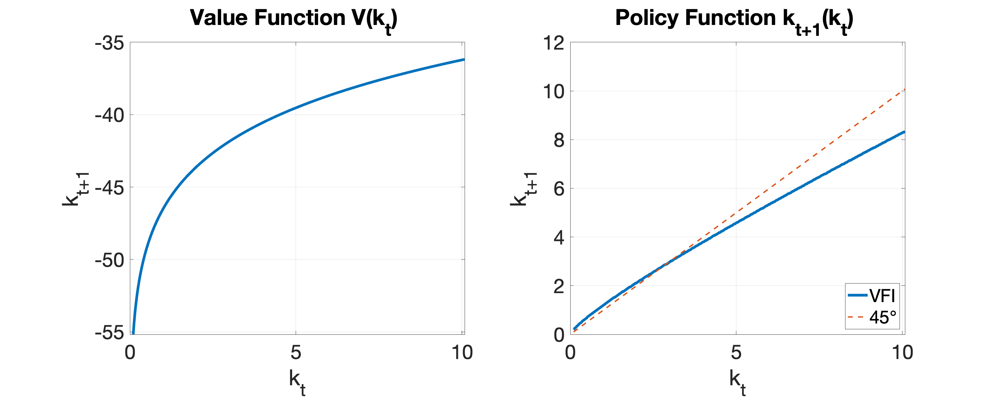
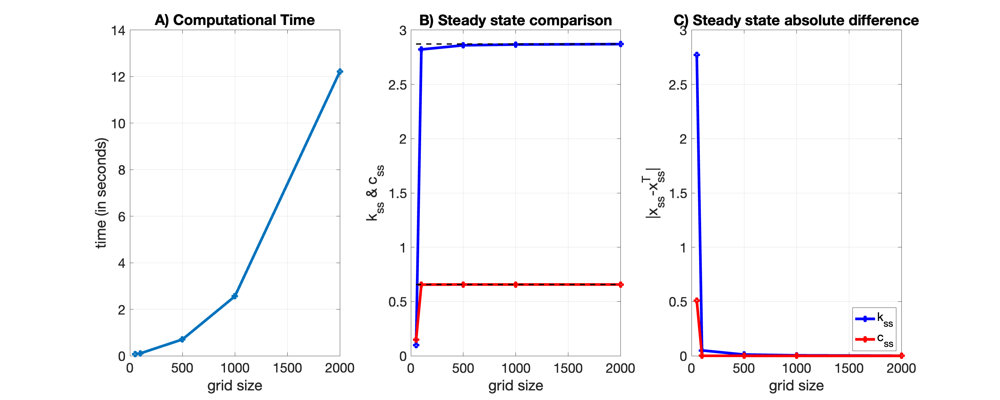

# TI1Computational (PS02)
Let me know if you have any questions!

## Q1b:  Comparison to previous (PS01) value & policy functions

## Q1c: Comparison of stochastic vs deterministic problem

## Q1d: Simulated paths

# TI1Computational (PS01)

## Q2a:  `delta=1.0` Comparison to theoretical value & policy function benchmark

## Q2b: `delta=0.5` Comparison to theoretical steady state benchmark

## Qcb: `delta=0.5` across different grid sizes

Available online here: https://github.com/jh3863/TI1Computational/tree/main
